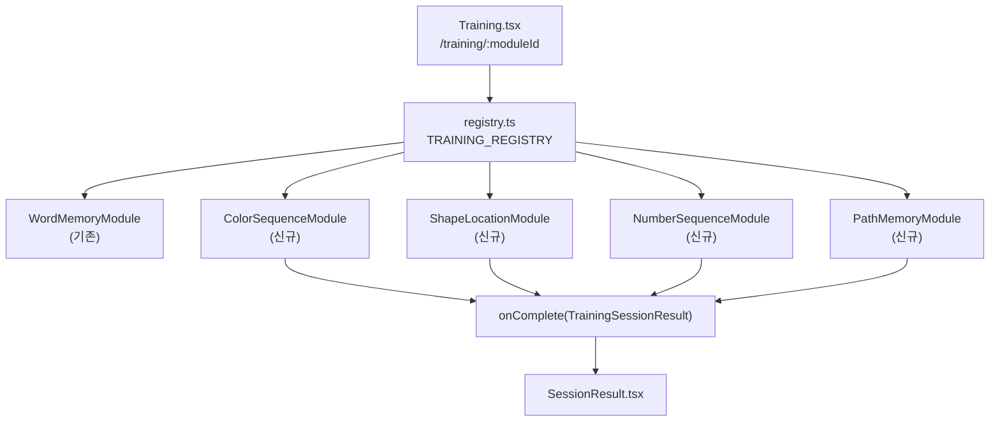

# 확장 훈련 모듈 4종 구현 계획

## 전체 아키텍처 흐름




## 공통 훈련 흐름 (4개 모듈 동일)

```
memorize(표시) → ready(준비) → recall(입력/선택) → result(완료 → onComplete)
```

---

## 신규 파일 목록

모두 `src/training/modules/` 아래에 생성:

- `[ColorSequenceModule.tsx](src/training/modules/ColorSequenceModule.tsx)`
- `[ShapeLocationModule.tsx](src/training/modules/ShapeLocationModule.tsx)`
- `[NumberSequenceModule.tsx](src/training/modules/NumberSequenceModule.tsx)`
- `[PathMemoryModule.tsx](src/training/modules/PathMemoryModule.tsx)`

기존 수정 파일:

- `[src/training/registry.ts](src/training/registry.ts)` — 4개 모듈 lazy import 및 등록
- `[src/types/training.ts](src/types/training.ts)` — 신규 모듈별 metadata 타입 추가 (선택)
- `[src/pages/Dashboard.tsx](src/pages/Dashboard.tsx)` — 훈련 목록에 새 모듈 카드 노출 여부 확인 (필요시 수정)

---

## 모듈별 상세 명세

### 1. 색 순서 (color-sequence)

- **memorize**: 3~~5개 색상 원이 1개씩 순서대로 깜빡임 (500~~1000ms/개)
- **recall**: 색상 버튼 6개 중 기억한 순서대로 탭
- **난이도별 시퀀스 길이**: easy=3, medium=5, hard=7
- **점수**: 정답 순서 수 / 전체 시퀀스 길이 × baseScore
- **색상 팔레트**: 빨강/파랑/초록/노랑/보라/주황 (6종)

### 2. 도형 위치 (shape-location)

- **memorize**: 4×4 그리드에 도형(○△□★)이 잠깐 표시 (easy 2초, medium 1.5초, hard 1초)
- **recall**: 빈 그리드에서 도형이 있던 위치 탭
- **난이도별 도형 수**: easy=3, medium=5, hard=7
- **점수**: 정답 위치 수 / 전체 도형 수 × baseScore

### 3. 숫자 순서 (number-sequence)

- **memorize**: 숫자 배열(0~9)이 순서대로 1개씩 플래시
- **recall**: 숫자패드(0~9)로 기억한 순서대로 입력
- **난이도별 시퀀스 길이**: easy=4, medium=6, hard=8
- **점수**: 연속 정답 수 기준 (틀리면 중단)

### 4. 경로 기억 (path-memory)

- **memorize**: 5×5 그리드에서 경로가 단계별로 하이라이트됨
- **recall**: 경로를 순서대로 탭하여 재현
- **난이도별 경로 길이**: easy=4, medium=6, hard=8
- **점수**: 경로 재현 정확도 × baseScore

---

## 공통 컴포넌트 패턴

모든 모듈은 `TrainingModuleProps`를 받고 `onComplete(TrainingSessionResult)`를 호출한다.

```typescript
// 각 모듈의 기본 구조 (예: ColorSequenceModule)
export function ColorSequenceModule({ difficulty, onComplete, onExit }: TrainingModuleProps) {
  const [phase, setPhase] = useState<'memorize' | 'ready' | 'recall' | 'result'>('memorize');
  // ...훈련 로직
  // phase === 'result' 시 onComplete(result) 호출
}
```

훈련 내부 상태는 모두 로컬 `useState`로 관리 (gameStore 의존 없음).

---

## registry.ts 변경 요약

```typescript
// 추가될 항목들
{ id: 'color-sequence',   name: '색 순서',   icon: '🎨', ... }
{ id: 'shape-location',   name: '도형 위치', icon: '🔷', ... }
{ id: 'number-sequence',  name: '숫자 순서', icon: '🔢', ... }
{ id: 'path-memory',      name: '경로 기억', icon: '🗺️', ... }
```

---

## Dashboard 연동

`TodayTrainingCard.tsx`와 Dashboard의 훈련 목록은 `TRAINING_REGISTRY`를 읽어 렌더링하므로, registry에 등록하면 자동으로 목록에 노출된다. Dashboard 코드 확인 후 필요 시 훈련 선택 UI를 추가한다.