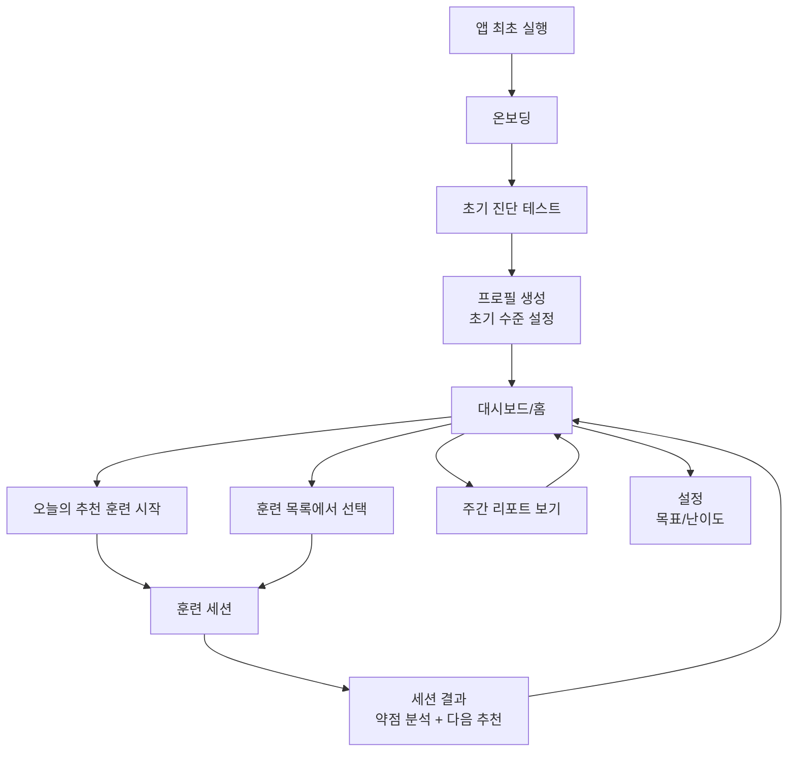

# 개인 맞춤형 기억력 훈련 앱 — 설계 문서

---

## 1. 제품/기능 목표 요약


| 항목             | 내용                                                        |
| -------------- | --------------------------------------------------------- |
| 핵심 가치          | 단순 미니게임이 아닌, 사용자의 수행 데이터를 분석해 개인화된 훈련 커리큘럼을 제공하는 두뇌 훈련 앱  |
| 목표 사용자         | 매일 짧은 시간(5~~10분) 뇌 훈련을 원하는 20~~40대                        |
| 핵심 차별점         | 진단 → 추천 → 훈련 → 분석의 루프 구조, 훈련 모듈 확장 가능 아키텍처                |
| App Store 포지셔닝 | "Personalized Memory Training" — 게임 앱이 아닌 헬스/피트니스 카테고리 인접 |


---

## 2. 기존 앱 구조 재해석

### 현재 구조의 한계

- `Home` → `Game` → `Result` → `Leaderboard` 의 단선형 플로우
- "오늘의 카테고리"에 종속된 단일 훈련 타입
- 사용자 히스토리 없음 (점수가 Supabase에 저장되나 사용자에게 분석 불가)
- 앱 정체성이 "일일 챌린지 게임"에 고정

### 재해석 방향

기존 게임 루프를 **훈련 모듈(TrainingModule)**로 추상화하고, 이를 감싸는 **훈련 프로그램 레이어**를 추가한다.

```
기존: Home → Game → Result
신규: Dashboard → TrainingSession → SessionResult → WeeklyReport
                      ↑
           [WordMemory | ColorSeq | ...]  ← 훈련 모듈 레지스트리
```

### 재사용 가능한 기존 자산 vs. 신규 개발 필요 항목


| 분류        | 기존 자산 (재사용)                                                              | 신규 개발 필요                                        |
| --------- | ------------------------------------------------------------------------ | ----------------------------------------------- |
| 핵심 훈련 로직  | `gameStore.ts` 전체, `useGame.ts`, `assignWords()`                         | 훈련 모듈 인터페이스 래퍼                                  |
| UI 컴포넌트   | `WordDisplay`, `ChoiceGrid`, `Timer`, `ReviewModal`, `wordAnimations.ts` | Dashboard, Report, Onboarding 화면                |
| 데이터 레이어   | `supabase.ts`, `localCategories.ts`, `useLeaderboard.ts`                 | `useTrainingHistory.ts`, `useRecommendation.ts` |
| 상태 관리     | `settingsStore.ts` (adRemoved), `gameStore.ts` partialize                | `userProfileStore.ts`, `historyStore.ts`        |
| 스타일/애니메이션 | Tailwind 퍼플 그라디언트, Framer Motion 패턴 전체                                   | Report 차트 (SVG 직접 구현)                           |
| 라우팅       | `App.tsx` Routes 구조                                                      | 신규 라우트 4개 추가                                    |
| 네이티브      | AdMob, IAP 전체                                                            | 없음 (그대로 유지)                                     |


---

## 3. 스팸 리스크를 낮출 수 있는 이유

기존 앱이 스팸으로 거부된 핵심 이유는 **"단순 메모리 게임 템플릿"처럼 보였기 때문**이다. 아래 변경으로 구조적 차별화를 달성한다.


| 리스크 요인               | 개선 방향                                            |
| -------------------- | ------------------------------------------------ |
| 앱 아이덴티티가 "일일 게임"에 고정 | 앱 카테고리를 "두뇌 훈련/교육"으로 재포지셔닝. 홈이 대시보드 형태           |
| 유사 앱과 동일한 메타데이터      | 스토어 설명을 "개인화", "훈련 프로그램", "리포트", "진단" 중심으로 전면 교체 |
| 훈련이 단 1가지            | 공통 훈련 모듈 구조를 통해 복수 훈련 타입 지원 (MVP에서 2가지 이상)       |
| 결과 화면이 점수/리더보드만 존재   | 세션 결과 → 약점 분석 → 다음 훈련 추천 플로우로 대체                 |
| 사용자 데이터 활용 없음        | 훈련 기록 로컬 저장 + 주간 리포트 = "개인화" 증거                  |


---

## 4. 핵심 사용자 플로우




---

## 5. MVP 범위

MVP에서 구현할 항목과 제외할 항목을 명확히 구분한다.

### MVP 포함

- 온보딩 (닉네임 + 훈련 목표 선택)
- 초기 진단 테스트 (기존 단어 기억 훈련 3세트 자동 진행)
- 대시보드 (오늘의 추천 훈련 + 최근 기록 요약)
- 단어 기억 훈련 (기존 구현 그대로 유지, 모듈로 래핑)
- 자동 난이도 조절 (규칙 기반)
- 세션 결과 화면 (기존 Result 확장 — 점수 + 약점 단어 + 다음 추천)
- 훈련 기록 로컬 저장 (`localStorage` + Zustand persist)
- 주간 리포트 (최근 7일 훈련 횟수, 평균 점수, 약점 카테고리)
- 훈련 모듈 레지스트리 구조 (확장 가능)

### MVP 제외 (확장 범위)

- 색 순서 / 도형 위치 / 숫자 순서 / 경로 기억 훈련
- 소셜 로그인
- 목표 설정 상세 화면
- 푸시 알림
- 리더보드 (기존 기능 유지는 하되 앱의 메인 CTA에서 제거)

---

## 6. 확장 범위


| 단계   | 기능                       |
| ---- | ------------------------ |
| v1.1 | 색 순서 기억 훈련 모듈 추가         |
| v1.2 | 숫자/기호 순서 기억 훈련 추가        |
| v1.3 | 훈련 목표 설정 + 연속 달성 스트릭     |
| v2.0 | 소셜 로그인, 친구 비교, 개인화 ML 모델 |


---

## 7. 화면 구조

```
앱 라우트
├── /onboarding          ← 신규 (최초 1회)
├── /diagnosis           ← 신규 (최초 1회)
├── /                    ← 기존 Home → Dashboard로 교체
├── /training/:moduleId  ← 기존 /game 확장 (moduleId='word-memory'가 기본)
├── /session-result      ← 기존 /result 확장
├── /report              ← 신규 (주간 리포트)
├── /leaderboard         ← 기존 유지 (메뉴 뎁스로 이동)
└── /settings            ← 신규 (기존 Home의 IAP 시트 분리)
```

### 각 화면 역할

- **Onboarding**: 닉네임, 훈련 목표(집중력 향상/기억력 유지/두뇌 건강 관리), 하루 훈련 목표 시간 선택
- **Diagnosis**: 3단계 자동 테스트 (Easy → Medium → Hard 순서로 각 1회씩), 진행률 UI, 완료 후 초기 수준 설정
- **Dashboard**: 오늘의 훈련 카드 + 연속 일수 + 최근 7일 미니 그래프 + 빠른 시작 버튼
- **Training**: 기존 Game 화면 = `moduleId`에 따라 훈련 컴포넌트 렌더링
- **SessionResult**: 기존 Result 확장 — 점수 + 정확도 + 약점 단어 + AI 추천 문구 + 다음 훈련 CTA
- **Report**: 주간 훈련 빈도 바 차트 + 평균 점수 추이 + 훈련 유형별 성취도
- **Settings**: 닉네임, 목표, 광고 제거(IAP), 데이터 초기화

---

## 8. 기능 명세

### 8-1. 온보딩

- **무엇을 만드는가**: 최초 실행 시 사용자 프로필 생성 화면
- **왜 필요한가**: Apple 심사관에게 "이 앱은 개인화된 훈련 앱"임을 첫 화면부터 증명
- **MVP 범위**: 닉네임 + 목표 선택 3가지 + 일일 목표 시간 선택 (1분/3분/5분)
- **필요 데이터**: `{ nickname, goal: 'focus'|'memory'|'health', dailyGoalMinutes: number }`
- **연결 화면**: 완료 후 `/diagnosis`로 이동, 이후 재진입 시 스킵

### 8-2. 초기 진단 테스트

- **무엇을 만드는가**: 앱 첫 실행 시 사용자의 현재 기억력 수준을 자동 측정하는 3단계 테스트
- **왜 필요한가**: 개인화의 기반 데이터. "당신의 현재 수준을 측정합니다" — 스팸 앱에는 없는 기능
- **MVP 범위**: 기존 단어 기억 훈련 Easy/Medium/Hard 각 1회 자동 실행, 결과로 초기 `baselineDifficulty` 설정
- **필요 데이터**: 각 단계 점수, 정확도, 소요 시간 → `userProfile.baselineScore`
- **연결 화면**: 완료 후 Dashboard로 이동

### 8-3. 대시보드

- **무엇을 만드는가**: 앱의 메인 홈 화면. 사용자의 훈련 현황과 오늘 할 일을 보여주는 개인화된 허브
- **왜 필요한가**: 심사관이 앱을 열었을 때 "훈련 프로그램 앱"임을 즉시 인식
- **MVP 범위**: 오늘의 추천 훈련 카드 1개, 연속 훈련 일수, 최근 7일 간이 그래프, 오늘 훈련 완료 여부 체크
- **필요 데이터**: `historyStore`의 최근 7일 세션 + `userProfile`의 추천 훈련
- **연결 화면**: 훈련 카드 클릭 → `/training/:moduleId`

### 8-4. 세션 결과

- **무엇을 만드는가**: 기존 Result 화면을 확장한 훈련 분석 화면
- **왜 필요한가**: 단순 점수 표시가 아닌 "약점 분석"과 "다음 추천"을 포함해야 개인화 앱으로 보임
- **MVP 범위**: 기존 점수/통계 유지 + 약점 단어 목록 + 한 줄 피드백 문구 + "다음 추천 훈련" 버튼
- **필요 데이터**: `gameStore`의 `missedWordsSnapshot`, `wrongCount`, `reviewCount`, `getScore()`
- **연결 화면**: "추천 훈련" CTA → `/training/:moduleId`, "홈으로" → Dashboard

### 8-5. 주간 리포트

- **무엇을 만드는가**: 최근 7일간의 훈련 데이터를 시각화한 리포트 화면
- **왜 필요한가**: 앱의 "기록/분석" 정체성을 가장 명확하게 보여주는 화면 — 스팸 앱에는 절대 없음
- **MVP 범위**: 일별 훈련 횟수 바 차트(SVG), 평균 점수, 평균 정확도, 가장 자주 틀린 단어 Top 5
- **필요 데이터**: `historyStore`의 `sessions[]` 최근 7일
- **연결 화면**: Dashboard의 "리포트" 버튼에서 접근

---

## 9. 기존 단어 기억 훈련 상세 설계 (재사용)

기존 구현을 **TrainingModule 인터페이스**로 래핑한다. 내부 로직은 변경하지 않는다.

### 훈련 식별자

```
moduleId: 'word-memory'
```

### 훈련 파라미터 (기존 DIFFICULTY_CONFIG 그대로)

```typescript
// 기존 types/index.ts — 변경 없음
DIFFICULTY_CONFIG: {
  easy:   { shownCount: 8,  wordDurationMs: 1000, decoyCount: 2, maxLives: 3, ... },
  medium: { shownCount: 10, wordDurationMs: 700,  decoyCount: 2, maxLives: 2, ... },
  hard:   { shownCount: 12, wordDurationMs: 500,  decoyCount: 3, maxLives: 1, ... },
}
```

### 훈련 단계 (기존 GamePhase 그대로)

```
memorize → ready → choose → result
```

### 재사용 컴포넌트

- `WordDisplay.tsx` — 단어 플래시 표시 (변경 없음)
- `ChoiceGrid.tsx` — 선택지 그리드 (변경 없음)
- `Timer.tsx` — 타이머 (변경 없음)
- `ReviewModal.tsx` — 다시 보기 (변경 없음)
- `wordAnimations.ts` — 애니메이션 (변경 없음)

### 세션 완료 시 출력 데이터 (기존 gameStore에서 추출)

```typescript
interface WordMemorySessionResult {
  moduleId: 'word-memory';
  score: number;           // getScore()
  accuracy: number;        // correctSelections.length / targetCount
  timeMs: number;          // endTime - startTime
  wrongCount: number;
  reviewCount: number;
  missedWords: string[];   // missedWordsSnapshot[].word
  difficulty: Difficulty;
  mode: GameMode;
  categoryName: string;
  completedAt: string;     // ISO timestamp
}
```

---

## 10. 훈련 공통 인터페이스 설계

모든 훈련 모듈은 아래 인터페이스를 구현한다. 향후 색 순서, 숫자 기억 등 추가 시 동일 패턴 사용.

```typescript
// src/training/types.ts (신규)
export interface TrainingModule {
  id: string;                          // 'word-memory' | 'color-sequence' | ...
  name: string;                        // '단어 기억' | '색 순서' | ...
  description: string;
  icon: string;                        // emoji
  supportedDifficulties: Difficulty[];
  component: React.ComponentType<TrainingModuleProps>;
}

export interface TrainingModuleProps {
  difficulty: Difficulty;
  mode?: string;
  onComplete: (result: TrainingSessionResult) => void;
  onExit: () => void;
}

export interface TrainingSessionResult {
  moduleId: string;
  score: number;
  accuracy: number;        // 0~1
  timeMs: number;
  difficulty: Difficulty;
  metadata: Record<string, unknown>;   // 모듈별 추가 데이터
  completedAt: string;
}

// src/training/registry.ts (신규)
export const TRAINING_REGISTRY: TrainingModule[] = [
  {
    id: 'word-memory',
    name: '단어 기억',
    description: '빠르게 지나가는 단어를 기억하고 맞추세요',
    icon: '📝',
    supportedDifficulties: ['easy', 'medium', 'hard'],
    component: WordMemoryTraining,  // 기존 Game 화면 래핑
  },
  // 향후 추가
  // { id: 'color-sequence', ... }
];
```

---

## 11. 개인화 로직 설계 (규칙 기반 MVP)

### 추천 훈련 결정 로직

```typescript
// src/lib/recommendation.ts (신규)
function getRecommendedTraining(profile: UserProfile, history: SessionRecord[]): RecommendedTraining {
  const recent7Days = history.filter(/* 최근 7일 */);

  // 규칙 1: 오늘 훈련을 아직 안 했으면 → 마지막으로 한 훈련 타입 추천
  if (recent7Days.filter(todayOnly).length === 0) {
    return { moduleId: lastModuleId || 'word-memory', difficulty: profile.currentDifficulty };
  }

  // 규칙 2: 정확도가 2회 연속 70% 미만이면 → 난이도 하향 추천
  if (last2Sessions.every(s => s.accuracy < 0.7)) {
    return { moduleId: same, difficulty: lowerDifficulty };
  }

  // 규칙 3: 정확도가 3회 연속 90% 이상이면 → 난이도 상향 추천
  if (last3Sessions.every(s => s.accuracy >= 0.9)) {
    return { moduleId: same, difficulty: higherDifficulty };
  }

  // 규칙 4: 동일 훈련 5회 이상 연속이면 → 다른 훈련 타입 추천 (있을 경우)
  // 규칙 5: 기본 → 현재 난이도 유지
  return { moduleId: profile.lastModuleId, difficulty: profile.currentDifficulty };
}
```

### 약점 분석 로직

```typescript
// 자주 틀린 단어 집계 (historyStore에서)
function getWeakWords(sessions: SessionRecord[]): string[] {
  const missedCount: Record<string, number> = {};
  sessions.forEach(s => {
    (s.metadata.missedWords || []).forEach((w: string) => {
      missedCount[w] = (missedCount[w] || 0) + 1;
    });
  });
  return Object.entries(missedCount)
    .sort((a, b) => b[1] - a[1])
    .slice(0, 5)
    .map(([word]) => word);
}
```

---

## 12. 난이도 조절 로직 설계 (규칙 기반 MVP)

### 자동 난이도 조절 트리거


| 조건                   | 액션              |
| -------------------- | --------------- |
| 최근 3세션 평균 정확도 ≥ 90%  | 난이도 +1 단계 상향 권장 |
| 최근 2세션 연속 정확도 < 70%  | 난이도 -1 단계 하향 권장 |
| 최근 3세션 평균 정확도 70~89% | 현재 난이도 유지       |
| 처음 플레이 (진단 완료 직후)    | 진단 결과 기반 설정     |


### 진단 테스트 초기 수준 결정

```typescript
function calculateBaselineDifficulty(
  easyScore: number, mediumScore: number, hardScore: number
): Difficulty {
  if (hardScore >= 800)   return 'hard';
  if (mediumScore >= 600) return 'medium';
  return 'easy';
}
```

### 표시 방식

- 자동으로 변경하지 않고 **세션 결과 화면에서 사용자에게 제안** ("다음 훈련은 HARD로 도전해 보세요")
- 사용자가 수락하면 `userProfile.currentDifficulty` 업데이트
- 거부 시 유지

---

## 13. 데이터 모델 설계

### UserProfile (로컬 저장)

```json
{
  "userId": "uuid",
  "nickname": "홍길동",
  "goal": "memory",
  "dailyGoalMinutes": 5,
  "currentDifficulty": "medium",
  "lastModuleId": "word-memory",
  "onboardingComplete": true,
  "diagnosisComplete": true,
  "baselineScore": 720,
  "createdAt": "2026-03-25T00:00:00Z"
}
```

### SessionRecord (로컬 저장)

```json
{
  "id": "uuid",
  "moduleId": "word-memory",
  "score": 850,
  "accuracy": 0.83,
  "timeMs": 12400,
  "difficulty": "medium",
  "completedAt": "2026-03-25T14:23:00Z",
  "metadata": {
    "missedWords": ["망고", "키위"],
    "wrongCount": 1,
    "reviewCount": 0,
    "categoryName": "과일",
    "mode": "basic"
  }
}
```

### WeeklyStats (계산값, 저장 불필요 — 매번 sessions에서 도출)

```json
{
  "weekStart": "2026-03-23",
  "totalSessions": 5,
  "avgScore": 810,
  "avgAccuracy": 0.79,
  "weakWords": ["망고", "키위", "파파야"],
  "streakDays": 3
}
```

### 기존 Supabase scores 테이블

- 변경 없음 (기존 리더보드 기능 유지)
- SessionRecord 저장은 `localStorage`만 사용 (Supabase 불필요)

---

## 14. 로컬 저장 구조

### localStorage 키 구조

```
mc-game-prefs        ← 기존 유지 (mode, difficulty, nickname)
mc-settings          ← 기존 유지 (adRemoved)
mc-user-profile      ← 신규 (UserProfile 전체)
mc-session-history   ← 신규 (SessionRecord[] 최근 90일, 최대 500건)
```

### 데이터 정책

- `SessionRecord`는 최대 500건, 90일 초과분 자동 삭제
- Supabase 연동은 리더보드 점수 제출에만 사용 (기존 유지)
- 오프라인 완전 지원 (`localCategories.ts` 기존 로직 유지)

---

## 15. 상태 관리 구조

### 기존 스토어 (유지)

- `useGameStore` — 훈련 진행 상태 (변경 없음)
- `useSettingsStore` — IAP 설정 (변경 없음)

### 신규 스토어

```typescript
// src/store/userProfileStore.ts (신규)
interface UserProfileStore {
  profile: UserProfile | null;
  isOnboarded: boolean;
  isDiagnosed: boolean;
  setProfile: (profile: UserProfile) => void;
  updateDifficulty: (d: Difficulty) => void;
  updateLastModule: (moduleId: string) => void;
}
// persist: 'mc-user-profile'

// src/store/historyStore.ts (신규)
interface HistoryStore {
  sessions: SessionRecord[];
  addSession: (session: SessionRecord) => void;
  getRecentSessions: (days: number) => SessionRecord[];
  getWeakWords: (days: number) => string[];
}
// persist: 'mc-session-history' (최대 500건 자동 트림)
```

### 훅 구조

```
useTrainingSession.ts  ← 기존 useGame.ts를 래핑, 완료 시 historyStore에 저장
useRecommendation.ts   ← userProfile + history → 추천 훈련 계산
useWeeklyReport.ts     ← history → 주간 통계 계산
useDiagnosis.ts        ← 진단 테스트 3단계 자동 진행
```

---

## 16. 컴포넌트 구조

```
src/
├── pages/
│   ├── Onboarding.tsx        ← 신규
│   ├── Diagnosis.tsx         ← 신규
│   ├── Dashboard.tsx         ← 신규 (기존 Home 대체)
│   ├── Training.tsx          ← 기존 Game.tsx 확장 (moduleId 라우트 파라미터 처리)
│   ├── SessionResult.tsx     ← 기존 Result.tsx 확장
│   ├── Report.tsx            ← 신규
│   ├── Settings.tsx          ← 신규 (기존 Home의 IAP 시트 분리)
│   └── Leaderboard.tsx       ← 기존 유지
│
├── components/
│   ├── game/                 ← 기존 전체 유지 (변경 없음)
│   │   ├── WordDisplay.tsx
│   │   ├── ChoiceGrid.tsx
│   │   ├── Timer.tsx
│   │   ├── ReviewModal.tsx
│   │   └── wordAnimations.ts
│   ├── dashboard/            ← 신규
│   │   ├── TodayTrainingCard.tsx
│   │   ├── StreakBadge.tsx
│   │   └── MiniBarChart.tsx
│   ├── report/               ← 신규
│   │   ├── WeeklyBarChart.tsx (SVG)
│   │   ├── AccuracyTrend.tsx
│   │   └── WeakWordList.tsx
│   └── leaderboard/          ← 기존 유지
│       ├── ScoreRow.tsx
│       └── TabSwitcher.tsx
│
├── training/                 ← 신규 (훈련 모듈 레지스트리)
│   ├── types.ts
│   ├── registry.ts
│   └── modules/
│       └── WordMemoryModule.tsx   ← 기존 Game 로직 래핑
│
├── store/
│   ├── gameStore.ts          ← 기존 유지
│   ├── settingsStore.ts      ← 기존 유지
│   ├── userProfileStore.ts   ← 신규
│   └── historyStore.ts       ← 신규
│
├── hooks/
│   ├── useGame.ts            ← 기존 유지
│   ├── useTimer.ts           ← 기존 유지
│   ├── useLeaderboard.ts     ← 기존 유지
│   ├── useTrainingSession.ts ← 신규 (useGame 래퍼 + 히스토리 저장)
│   ├── useRecommendation.ts  ← 신규
│   ├── useWeeklyReport.ts    ← 신규
│   └── useDiagnosis.ts       ← 신규
│
└── lib/
    ├── supabase.ts           ← 기존 유지
    ├── localCategories.ts    ← 기존 유지
    ├── admob.ts              ← 기존 유지
    ├── iap.ts                ← 기존 유지
    └── recommendation.ts     ← 신규 (순수 함수)
```

---

## 17. 폴더 구조 제안

위 컴포넌트 구조 그대로 적용. 핵심 원칙:

- `training/` 디렉토리를 신설해 모듈 레지스트리를 분리
- `components/game/` 은 절대 건드리지 않음 (기존 훈련 메커니즘 보존)
- `pages/` 의 기존 파일은 rename이 아닌 확장으로 처리

---

## 18. 리팩터링 우선순위


| 우선순위 | 대상                                    | 방식                    |
| ---- | ------------------------------------- | --------------------- |
| P0   | `App.tsx` 라우트 추가                      | 기존 라우트 유지 + 신규 라우트 추가 |
| P0   | `userProfileStore.ts` 생성              | 신규 파일                 |
| P0   | `historyStore.ts` 생성                  | 신규 파일                 |
| P0   | `training/registry.ts` 생성             | 신규 파일, 기존 Game 래핑     |
| P1   | `Dashboard.tsx` 생성                    | 신규 파일, Home 기능 일부 이전  |
| P1   | `SessionResult.tsx` 확장                | 기존 Result.tsx 기반 확장   |
| P1   | `Onboarding.tsx` 생성                   | 신규 파일                 |
| P1   | `Diagnosis.tsx` 생성                    | 신규 파일                 |
| P2   | `Report.tsx` 생성                       | 신규 파일                 |
| P2   | `useTrainingSession.ts` 생성            | useGame 래퍼            |
| P3   | 기존 `Home.tsx` → `Settings.tsx` IAP 이전 | 기존 파일 분리              |
| P3   | 기존 `Leaderboard.tsx` — 메뉴 뎁스로 이동      | 라우트만 변경               |


---

## 19. 단계별 구현 순서

### Phase 1 — 데이터 레이어 (3~4일)

1. `src/types/training.ts` 신규 타입 정의
2. `userProfileStore.ts` 구현 + 테스트
3. `historyStore.ts` 구현 (자동 트림 포함)
4. `training/registry.ts` + `WordMemoryModule.tsx` (기존 Game 래핑)
5. `src/lib/recommendation.ts` 순수 함수 구현

### Phase 2 — 신규 화면 (5~7일)

1. `Onboarding.tsx` 구현
2. `Diagnosis.tsx` 구현 (useDiagnosis 훅 포함)
3. `Dashboard.tsx` 구현 (TodayTrainingCard, MiniBarChart 포함)
4. `App.tsx` 라우트 재구성 + 온보딩 가드

### Phase 3 — 기존 화면 확장 (3~4일)

1. `Training.tsx` — moduleId 파라미터 처리, useTrainingSession 연동
2. `SessionResult.tsx` — 약점 분석 + 추천 UI 추가, historyStore 저장
3. `Settings.tsx` — IAP 시트 이전 + 닉네임/목표 설정

### Phase 4 — 리포트 + 마무리 (3~4일)

1. `Report.tsx` + SVG 차트 컴포넌트 구현
2. 스토어 메타데이터/설명 전면 교체
3. 앱 아이콘 교체 (별도 디자인 작업)
4. 전체 플로우 통합 테스트

---

## 20. 테스트 전략


| 영역     | 전략                                                                             |
| ------ | ------------------------------------------------------------------------------ |
| 순수 함수  | `recommendation.ts`, `historyStore`의 `getWeakWords`, 진단 로직 → Vitest 단위 테스트     |
| 스토어    | Zustand 스토어 persist 동작 → Vitest + localStorage mock                            |
| 훈련 플로우 | WordMemoryModule 전체 플로우 (memorize→ready→choose→result) → React Testing Library |
| E2E    | 온보딩 → 진단 → 대시보드 → 훈련 → 결과 → 리포트 → Playwright (또는 수동 디바이스 테스트)                  |
| 회귀 방지  | 기존 `gameStore.ts`의 `getScore()`, `selectWord()`, `assignWords()` 단위 테스트 추가     |


---

## 21. App Store 심사 대응 관점의 차별화 포인트


| 심사 기준       | 대응                                            |
| ----------- | --------------------------------------------- |
| 고유한 기능      | 진단 테스트 + 개인화 난이도 추천 = 타 앱에 없는 기능              |
| 단순 게임 클론 아님 | 홈이 대시보드 형태, 리포트 화면 존재                         |
| 콘텐츠 완성도     | 온보딩 플로우 + 주간 리포트 = 앱이 "완성된 제품"처럼 보임           |
| 메타데이터       | 스토어 설명에 "개인화", "진단", "훈련 리포트", "약점 분석" 키워드 포함 |
| 스크린샷        | 대시보드, 진단 화면, 리포트 화면 스크린샷 → 기존 게임 앱과 명확히 다름    |
| 앱 카테고리      | Health & Fitness 또는 Education 카테고리로 재분류 고려    |


---

## 22. 리스크와 의사결정 포인트


| 리스크                        | 대응 방안                                                 |
| -------------------------- | ----------------------------------------------------- |
| 리팩터링 중 기존 훈련 로직 손상         | `components/game/` 및 `gameStore.ts`를 완전히 동결, 래핑만      |
| 히스토리 데이터가 쌓이지 않아 리포트 비어 보임 | 진단 테스트 3회 완료 시 초기 데이터로 사용, 빈 상태 UI 별도 설계              |
| 온보딩이 길어서 이탈                | 온보딩은 최대 3단계, 각 단계 15초 내 완료 가능하도록                      |
| Supabase 의존성               | 기존 로컬 폴백 구조 유지. 세션 히스토리는 아예 로컬만 사용                    |
| App Store 재심사 통과 불확실       | Resolution Center에 온보딩/진단/리포트 기능을 스크린샷과 함께 설명하는 메모 제출 |


---

## 최소 변경안 vs. 심사 강화안 비교

### 안 A: 최소 변경안 (기존 구현 최대 유지)

변경 범위: 신규 파일 추가만, 기존 파일 최소 수정

- `App.tsx`에 라우트 3개 추가 (Dashboard, Report, Settings)
- `userProfileStore.ts`, `historyStore.ts` 신규 생성
- 기존 `Home.tsx` → `Dashboard.tsx`로 rename + 추천 훈련 카드 1개 추가
- 기존 `Result.tsx` → 약점 분석 섹션 추가
- `Report.tsx` 신규 생성 (간단한 텍스트 기반 리포트)
- 온보딩: 기존 Home의 닉네임 입력을 첫 실행 전용 화면으로 분리

**장점**: 개발 기간 1~2주, 기존 버그 재현 위험 낮음  
**단점**: 심사관에게 차별성이 다소 약할 수 있음

---

### 안 B: 심사 강화안 (권장)

변경 범위: 위 설계 문서 전체 구현

- 온보딩 + 진단 테스트 전체 구현
- 대시보드 (연속 일수, 미니 그래프, 추천 카드)
- 세션 결과 확장 (약점 분석 + 다음 훈련 추천)
- 주간 리포트 (바 차트 포함)
- 훈련 모듈 레지스트리 구조

**장점**: App Store 심사 통과 가능성 높음, 장기적으로 확장 용이  
**단점**: 개발 기간 3~4주

**권장**: 안 B를 Phase 1~~2까지 우선 구현하고 제출. Phase 3~~4는 업데이트로 진행.

---

## 가정 사항 (명시)

- Supabase `daily_categories` / `words` 테이블 구조는 변경하지 않는다고 가정
- 추가 훈련 모듈(색 순서 등)은 MVP에 포함하지 않고 레지스트리 구조만 준비한다고 가정
- 앱 아이콘/스플래시 디자인은 별도 디자인 작업으로 진행한다고 가정
- Vitest는 아직 프로젝트에 없으므로 테스트 추가 시 별도 설치 필요
- `cordova-plugin-purchase` (IAP)는 현행 유지, 새 기능에 연동 불필요

